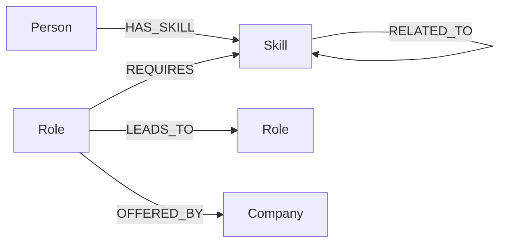
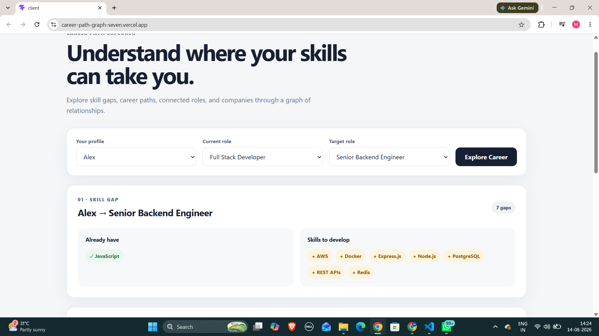
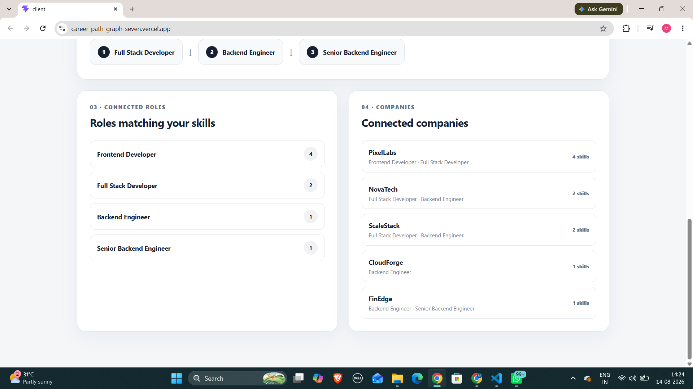

# Career Path Explorer

A graph-based career exploration application built with **React, Node.js, Express, CognoDB, and the official Neo4j JavaScript driver**.

The application helps users understand how their current skills connect to roles, career paths, and companies.

## Use Case

A user selects:

- Their profile
- Their current role
- Their target role

The application then shows:

1. Skills they already have
2. Skills missing for the target role
3. A possible career progression between roles
4. Roles connected to their existing skills
5. Companies connected to those roles

## Why a Graph Database?

The core data is relationship-driven.

For example:

```text
Person
  └── HAS_SKILL → Skill
                       └── REQUIRES ← Role
                                      └── OFFERED_BY → Company

Role
  └── LEADS_TO → Role
                    └── LEADS_TO → Role
```

A graph database makes these multi-hop relationships natural to traverse.

For example:

```text
Frontend Developer
        ↓
Full Stack Developer
        ↓
Backend Engineer
```

## Graph Model

### Nodes

- `Person`
- `Skill`
- `Role`
- `Company`

### Relationships

- `HAS_SKILL`
- `REQUIRES`
- `RELATED_TO`
- `LEADS_TO`
- `OFFERED_BY`

### Diagram



## Main Queries

### Skill Gap

Compares a person's skills with the skills required by a target role.

Returns:

- Matched skills
- Missing skills

### Career Path

Finds a possible progression between two roles using `LEADS_TO` relationships.

Example:

```text
Frontend Developer
→ Full Stack Developer
→ Backend Engineer
```

### Connected Roles

Finds roles connected to the skills a person already has and counts matching skills.

### Connected Companies

Traverses:

```text
Person
→ Skill
→ Role
→ Company
```

to find companies connected to the person's skill set.

## Project Structure

```text
career-path-graph/
├── server/
│   ├── scripts/
│   │   └── seed.js
│   └── src/
│       ├── config/
│       ├── controllers/
│       ├── queries/
│       ├── routes/
│       ├── services/
│       └── server.js
│
├── client/
│   └── src/
│
├── Screenshots/
│
└── README.md
```

## Tech Stack

- React
- Node.js
- Express
- CognoDB
- Neo4j JavaScript Driver
- Cypher
- Vite

## Setup

### 1. Clone the repository

```bash
git clone https://github.com/Manideepsainell/career-path-graph.git
cd career-path-graph
```

### 2. Configure the server

```bash
cd server
npm install
```

Create a `.env` file:

```env
COGNODB_URI=<your-cognodb-uri>
COGNODB_USERNAME=<your-username>
COGNODB_PASSWORD=<your-password>
PORT=5000
```

### 3. Seed the database

```bash
node scripts/seed.js
```

### 4. Start the backend

```bash
npm run dev
```

### 5. Configure the frontend

Open another terminal:

```bash
cd client
npm install
```

Create a `.env` file:

```env
VITE_API_URL=http://localhost:5000/api
```

### 6. Start the frontend

```bash
npm run dev
```

The application will be available at:

```text
http://localhost:5173
```

## Seed Data

The seed script creates:

- 5 people
- 24 skills
- 8 roles
- 6 companies

along with the relationships connecting them.

## Screenshots

### Career Explorer



### Skill Gap and Career Connections



## Demo

**Live Demo:**  
https://career-path-graph-seven.vercel.app/

**Backend:**  
https://career-path-graph.onrender.com/

**Repository:**  
https://github.com/Manideepsainell/career-path-graph

## Author

Manideep Sai Nellutla